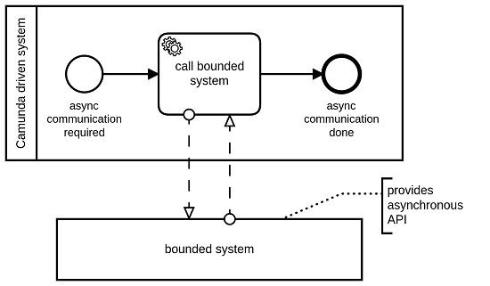

<a href="https://github.com/camunda-community-hub/community" target="_blank"></a>

# </img>&nbsp;Camunda Externaltask Handler

This library provides the ExternalTaskHandler bean which can be used for local implementation of [Camunda's external tasks ](https://docs.camunda.org/manual/7.14/user-guide/process-engine/external-tasks/) in a simplified way.

Advantages:
* Loose coupling since this API does not use Camunda specific classes
* Simplified API for reading and setting process variables
* Streamlined error handling regardless of the current thread's owner (application thread or job executor thread)
* Exponential back-off retry handling which is useful for doing remote calls
* Don't block job execution thread by doing synchronous processing of activities 

Disadvantages:
* External tasks need more transactions and therefore are slower in execution. For common business processes this is not an issue.

*Usage:*

In Camunda modeler choose "External" as type of implementation of a certain activity. Choose a unique topic name. Depending on whether you need synchronous or asynchronous processing follow the instructions of the corresponding next section to register a handler for this particular activity (identified by it's topic name) as part of your Java implementation.


## Synchronous processing

In this scenarios the ExternalTaskHandler is a substitute for these Camunda implementations:
* Java delegate
* Expression delegate
* Expression

It can be used for simple tasks or for tasks doing synchronous remote communication.

*Usage:*

```java
  @PostConstruct
  private void init() {
    // variant 1:
    externalTaskHandler.registerExternalTaskProcessor(
        "myprocess", "mytopic1", this::processServiceTask1); 
    // variant 2:
    externalTaskHandler.registerExternalTaskProcessor(
        "myprocess", "mytopic2",
        ((processInstanceId, activityId, executionId, variables, retries)
            -> processServiceTask2(variables))); 
  }
  
  public Map<String, Object> processServiceTask1(
      String processInstanceId, String activityId,
      String executionId, Map<String, Object> variables,
      Integer retries)
      throws BpmnError, RetryableException, Exception {
    // do something or throw exception for incident
  }

  private Map<String, Object> processServiceTask2(
      Map<String, Object> variables) {
    final var orderId = variables.get("orderId");
    final var result = doWhatever(orderId);
    return Map.of("whatever", result);
  }
```
A processor method for a certain process definition and a specific topic has to be registered. The method receives process information and variables according to the registration method used. A processor method can
* return a map of process variables to be set
* return null if no process variables should be set
* throw a BpmnError if an error should be handled by Camunda
* throw a BpmnErrorWithVariables if an error should be handled by Camunda and additionally variables should be set
* throw a RetryableException if an incident should be created after a defined number of further attempts
* throw an Exception if an incident should be created immediately

*Hint*: The processor method is called immediately after task creation but in an asynchronous fashion having its own transaction. Therefor you need to be aware of possible OptimisticLockingExceptions (see Camunda's ["best practices"](https://camunda.com/best-practices/dealing-with-problems-and-exceptions/#__strong_do_strong_configure_a_savepoint_strong_before_strong)). As a rule of thumb an "asyncAfter=true" can be placed on each task processed by the ExternalTaskHandler.

## Asynchronous processing

In this scenarios the ExternalTaskHandler can be used to do asynchronous communication as part of a BPMN activity.

Using Camunda's API one has to model asynchronous communication like this:


But this is a technical aspect of the implemenation and therefore should not be part of the BPMN. Using the ExternalTaskHandler one can use model underneath hiding the details of the technical implementation:



*Usage:*

```java
  @Autowired
  private ExternalTaskHandler externalTaskHandler;
  
  @Autowired
  private AsyncApiClient client;
  
  @PostConstruct
  private void init() {
    externalTaskHandler
        .<String, MyResponse>registerExternalTaskProcessor(
            "myprocess", "mytopic1",
            this::doRequest,
            (processInstanceId, activityId, executionId, retries, correlationId, response, variableToBeSet)
                -> processResponse(correlationId, response, variableToBeSet); 
  }
   
  private void doRequest(String correlationId,
      String processInstanceId, String activityId,
      String executionId, Map variables, Integer retries)
      throws BpmnError, RetryableException, Exception {
    try {
      client.doSyncCall(correlationId, variables.get("myOrderId"));
    } catch (Exception e) {
      throw new RetryableException("remote call failed", e,
          4, retries, List.of(5000l, 60000l));
    }
  }

  private String processResponse(String correlationId,
      MyResponse response) throws BpmnError, Exception {
    final String result = doWhatever(correlationId, myResponse);
    variableToBeSet.put("whatever", result);
    return "Thank you ;-)";
  }
   
  @RequestMapping(
      value = "/my-async-response-rest-api/{correlationId}",
      method = RequestMethod.POST)
  public ResponseEntity<String> processAsyncRestResponse(
      @PathVariable("correlationId") correlationId,
      @RequestBody MyResponse data) {
    final String resultMessage = externalTaskHandler
        .handleAsyncInput(correlationId, data);
    return ResponseEntity.ok(resultMessage);
  }
```

In this situations two handlers need to be registered:

1. The request handler which is responsible for sending the synchronous request to a remote system
2. The response handler which completes the BPMN activity by processing a the asynchronous response message

Ad 1: A correlation id is provided which should be send to the remote system. It has to be part of the asynchronous response and is necessary to correlate the response message to a particular waiting BPMN activity. Unlike the synchronous handler this request handler has a void return value since no process variables may be set as part of sending the request. If this is necessary one has to use the Camunda API. This handler supports the same error handling strategies as the synchronous handler.

Ad 2: The response handler is called once the an asynchronous response has been handed over by calling the method "handleAsyncInput". The result value of this handler is passed to the caller of the "handleAsyncInput" method and my be forwarded to the remote system waiting to complete the asynchronous remote call. Additionally, any exception thrown by the handler will be passed to the caller of the "handleAsyncInput" method and will NOT cause an incident! The handler's parameter "variablesToBeSet" can be used to set process variables on completing the BPMN activity. If upcoming processing of the workflow causes an exception and incident will be created.

Hint: See also ["Advanced usage / Async response timeout"](#Async-response-timeout).

## Advanced usage

### Fetching variables

As a default behavior all process instance variables of the current scope (process, subprocess, etc.) are loaded and provided in a processor's variable map.

Sometimes it is wise to limit the process instance variables loaded to those required to complete a particular external task. Reasons are
1. Avoid network IO
1. Avoid deserialization of complex variables not used 

To do so the names of the variables have to be defined like this:
```java
externalTaskHandler.registerExternalTaskProcessor(
        "myprocess", "mytopic1",
        this::processServiceTask1)
    .variablesToFetch("var1", "var2");
```
or like this:
```java
var variableNames = List.of("var1", "var2");
externalTaskHandler.registerExternalTaskProcessor(
        "myprocess", "mytopic1",
        this::processServiceTask1)
    .variablesToFetch(variableNames);
```

If one needs no process variables at all then this API can be used:
```java
var variableNames = List.of("var1", "var2");
externalTaskHandler.registerExternalTaskProcessor(
        "myprocess", "mytopic1",
        this::processServiceTask1)
    .fetchNoVariables();
```

### Lock timeout

External tasks need to be locked. So processing should not take more time than the lock timeout. The default timeout is a minute. If the lock timeout expires (for example due to system failures) then the task will be retried in an one minute interval. A non standard lock timeout can be defined on regristration.

```java
externalTaskHandler.registerExternalTaskProcessor(
        "myprocess", "mytopic1",
        this::processServiceTask1)
    .lockTimeout(30000l);
```

### Exponential back-off retry handling

The external task retry counter is provided which has to be passed to the RetryableException to use the retry mechanism. The exception's constructor takes the configuration values for exponential back-off retry behavior (see Javadoc of [RetryableException](./externaltask-handler-spi/src/main/java/org/camunda/bpm/externaltask/spi/RetryableException.java)).

```java
  public Map<String, Object> processServiceTask1(
      String processInstanceId, String activityId,
      String executionId, Map<String, Object> variables,
      Integer retries)
      throws BpmnError, RetryableException, Exception {
    try {
      doRemoteCall();
    } catch (Exception e) {
      // retry after 5 seconds and afterwards every minute,
      // all together 4 times. if all 5 attempts fail an
      // incident is created
      throw new RetryableException("remote call failed", e,
          4, retries, List.of(5000l, 60000l));
    }
  }
```

### Async response timeout

Doing asynchronous processing or communication one might want to make the task fail if there is no response in time. This cannot be achieved by setting the lock timeout because if this period expires a second attempt of completing this task will be started. If you want an incident to be created then you can define a response timeout:

```java
externalTaskHandler
    .<String, MyResponse>registerExternalTaskProcessor(
        "myprocess", "mytopic1",
        this::doRequest,
        this::processResponse)
    .responseTimeout(60000l)
    .responseTimeoutExpiredMessage("No response on time!"); 
```

Additionally you can define a timeout per request by returing a value other than null as part of the request processing (see [org.camunda.bpm.externaltask.spi.ExternalTaskHandlerAsyncRequestProcessor](./externaltask-handler-spi/src/main/java/org/camunda/bpm/externaltask/spi/ExternalTaskHandlerAsyncRequestProcessor.java)).

## Spring

Dependency:

```xml
<dependency>
  <groupId>org.camunda.bpm.externaltask</groupId>
  <artifactId>spring-externaltask-handler</artifactId>
</dependency>
```

Usage:

```java
@Autowired
private ExternalTaskHandler externalTaskHandler;
  
@PostConstruct
private void init() {
  // see examples in the top section of the README.md
}
```

### Preconditions

Asynchronous and scheduled task processing musted be configured properly. 

Find the class [org.camunda.bpm.externaltask.spring.AsyncConfiguration](./spring-externaltask-handler/src/test/java/org/camunda/bpm/externaltask/spring/AsyncConfiguration.java) in `src/test/java` as an example how this can be achieved.

### Lock timeout

The default lock timeout can be configured using the property `camunda.bpm.externaltask-handler.default-locktimeout`.

### Testing

There is a [integration test](./spring-externaltask-handler/src/test/java/org/camunda/bpm/externaltask/spring/SpringExternalTaskHandlerIT.java) which tests the Spring integration and the entire functionality of the ExternalTaskHandler.

## EJB

Dependency:

```xml
<dependency>
  <groupId>org.camunda.bpm.externaltask</groupId>
  <artifactId>ejb-externaltask-handler</artifactId>
</dependency>
```

Usage:

```java
@EJB
private ExternalTaskHandler externalTaskHandler;

@PostConstruct
private void init() {
  // see examples in the top section of the README.md
}
```

### Preconditions

To configure the default lock timeout and the worker id you have to provide a CDI implemenation of the interface [org.camunda.bpm.externaltask.cdi.ExternalTaskHandlerConfigurator](./ejb-externaltask-handler/src/main/java/org/camunda/bpm/externaltask/cdi/ExternalTaskHandlerConfigurator.java). It can be used to load those values externally e.g. from a configuration file or a system property. For an example see [MyCdiExternalTaskConfigurator](./ejb-externaltask-testwebapp/src/main/java/org/camunda/bpm/externaltask/MyCdiExternalTaskConfigurator.java).

### Testing

There are integration tests for the Spring integration. 

Additionally, there is a test webapp `ejb-externaltask-testwebapp`. It tests the EJB integration and the core functionality of the ExternalTaskHandler. Once deployed it can be used by these REST-endpoints:
* [http://localhost:8080/ejb-externaltask-testwebapp-0.0.1-SNAPSHOT/api/test/handle](http://localhost:8080/ejb-externaltask-testwebapp-0.0.1-SNAPSHOT/api/test/handle)
* [http://localhost:8080/ejb-externaltask-testwebapp-0.0.1-SNAPSHOT/api/test/retry](http://localhost:8080/ejb-externaltask-testwebapp-0.0.1-SNAPSHOT/api/test/retry)
* [http://localhost:8080/ejb-externaltask-testwebapp-0.0.1-SNAPSHOT/api/async-test/handle](http://localhost:8080/ejb-externaltask-testwebapp-0.0.1-SNAPSHOT/api/async-test/handle)
* [http://localhost:8080/ejb-externaltask-testwebapp-0.0.1-SNAPSHOT/api/async-test/retry](http://localhost:8080/ejb-externaltask-testwebapp-0.0.1-SNAPSHOT/api/async-test/retry)

## Maintenance &amp; License

<a href="https://www.phactum.at" target="_blank"></img></a>
Phactum<br/>[Company](www.phactum.at) &#8226; [GitHub](https://github.com/phactum-at)
&#8226; [E-Mail](mailto:stephan.pelikan@phactum.at)<br/>Apache License, Version 2.0